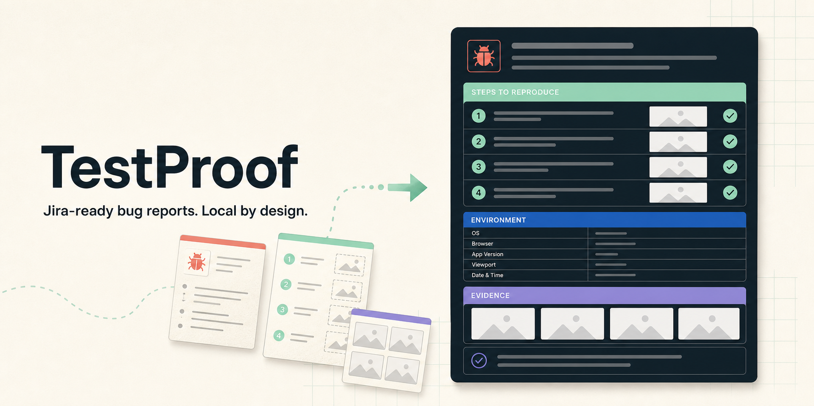
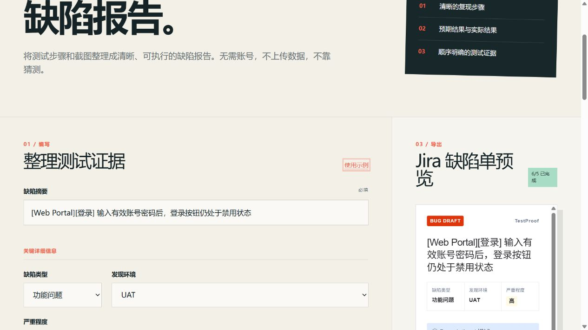
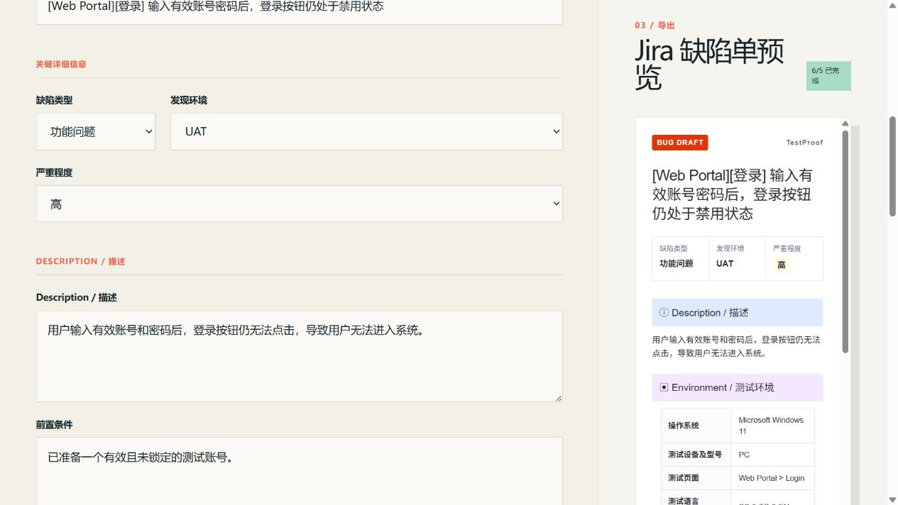
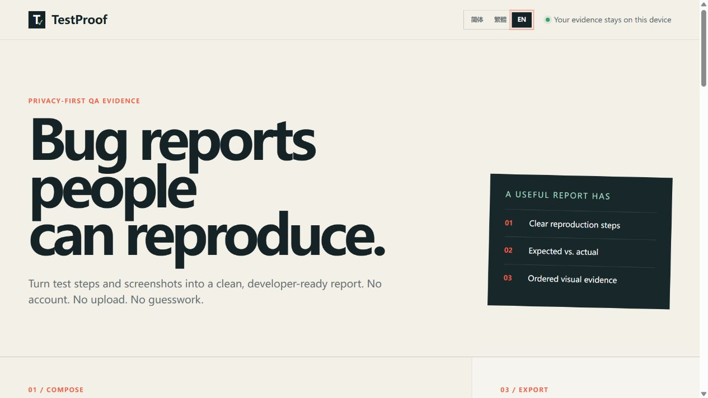

# TestProof



TestProof is a privacy-first browser tool for turning test notes and screenshots
into structured, developer-ready bug reports. It provides a Jira-style report
preview, ordered evidence, Markdown export, and print-ready PDF output—without
requiring an account or uploading report data to a server.

## Why TestProof?

Bug reports often miss the exact environment, reproduction journey, or expected
result that developers need. TestProof guides the reporter through a complete
template and keeps Actual and Expected results visibly separated, so the final
ticket is easier to reproduce and investigate.

## Screenshots

### Structured report builder and live Jira preview



### Jira-style sections and environment table



### Simplified Chinese, Traditional Chinese, and English



## Features

- Complete Jira-style bug template:
  - Summary, defect type, identified environment, and severity
  - Description and preconditions
  - Operating system, device, tested page, language, browser, and role
  - English `Step 1:`, `Step 2:` reproduction journey
  - Actual result, expected result, impact, developer checking point, and remark
- Color-coded report sections inspired by practical Jira QA workflows
- Drag-and-drop screenshot evidence with preview, ordering, and removal controls
- Live report preview using fictional or user-provided test data
- Copy-ready Markdown and downloadable `.md` report
- Browser print layout for **Print / Save as PDF**
- Simplified Chinese (`zh-CN`), Traditional Chinese (`zh-TW`), and English (`en`)
- Responsive and keyboard-accessible interface
- No account, backend, analytics service, or screenshot upload

## Typical workflow

1. Enter the bug summary and key Jira details.
2. Record the environment and preconditions.
3. Add one reproduction action per line; TestProof formats them as numbered
   English `Step` entries.
4. Describe corresponding Actual and Expected results.
5. Attach screenshots and arrange them in evidence order.
6. Copy the Markdown, download the `.md` file, or select **Print / Save PDF**.

## Run locally

Requires Node.js 22.13 or newer. The project pins pnpm 11.16.0.

```bash
corepack pnpm install
corepack pnpm dev
```

Open [http://localhost:3000](http://localhost:3000).

Do not run `npm install` in this repository. The checked-in lockfile and local
dependency layout are managed by pnpm.

## Build and test

```bash
corepack pnpm build
corepack pnpm test
```

## PDF export

TestProof uses the browser's native print dialog instead of sending the report
to a PDF service. Select **Print / Save PDF**, choose **Save as PDF** in the
dialog, and save the generated Jira-style document locally. Report sections,
environment tables, and screenshot evidence include print-specific pagination
rules.

## Privacy

TestProof is local by design:

- Report fields remain in the current browser session.
- Screenshots use temporary browser object URLs and are not uploaded by the app.
- There is no account system, database, backend report service, or analytics SDK.
- Refreshing or closing the page clears the working report and temporary image
  references.
- Markdown downloads and PDF printing are performed by the user's browser.

Even with local processing, avoid placing passwords, tokens, cookies, private
keys, real customer information, or confidential workplace screenshots in demo
reports, GitHub issues, or public examples.

## Technology

- React 19
- TypeScript
- Vinext + Vite
- Tailwind CSS
- pnpm

## Roadmap

- Screenshot annotation and privacy redaction
- Direct GitHub Issue and Jira integrations
- Playwright report import
- Downloadable evidence bundles
- More report templates and languages

## Contributing

Bug reports and small, focused pull requests are welcome. Public issues and pull
requests must use fictional or safely redacted QA data.

## License

[MIT](LICENSE)
